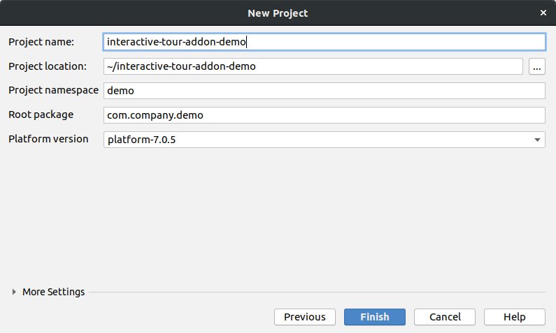
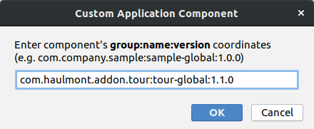
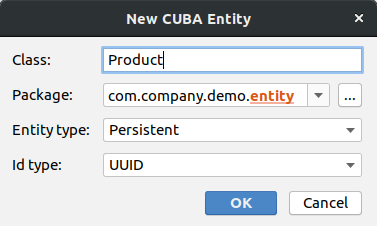
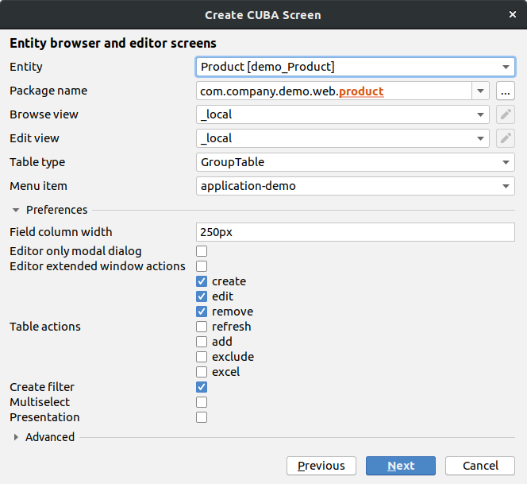
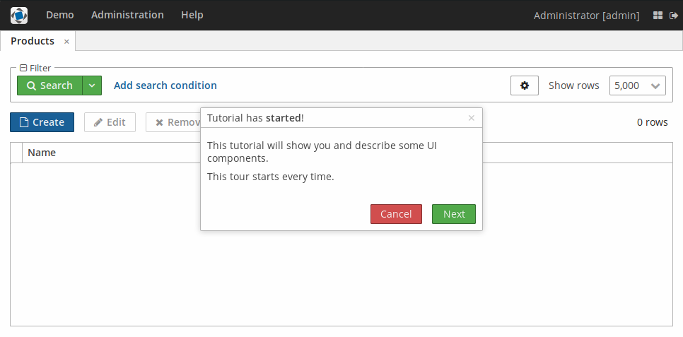
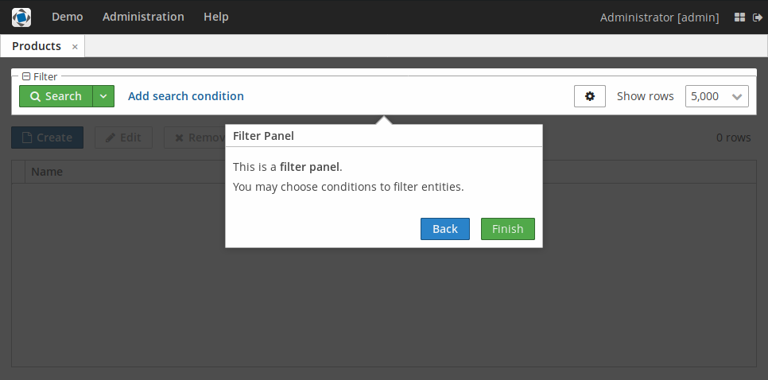
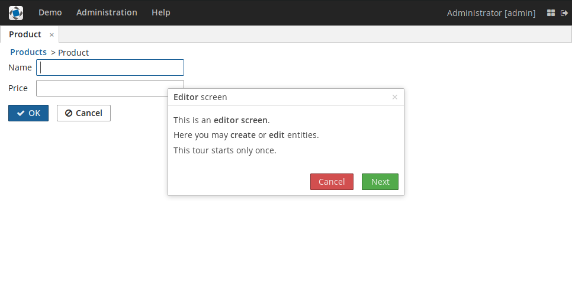
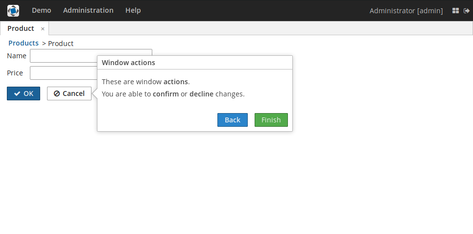

### Preface
This add-on is designed to create **product tour** for screens in the projects based on 
[CUBA platform](https://www.cuba-platform.com).

### Main features
The following components are used to create and run tours:
- **Tour** (A tour consisting of one or multiple steps)
- **Step** (A single step of a tour)
- **StepButton** (A button of a step that can be used to provide different actions if clicked)
- **TourStartAction** (Standard action to start a tour)
- **TourParser** (Parser of Tour objects)

### Usage
Select a version of the add-on which is compatible with the platform version used in your project:

| Platform Version| Add-on Version|
|:----------------|:--------------|
| 7.1.0           | 1.2.0         |
| 7.0.5           | 1.1.0         |
| 6.10.8          | 1.0.2         |


Add custom application component to your project (change the version part if needed):
```
com.haulmont.addon.tour:tour-global:1.2.0   
```

### Description
This add-on enables creating a product tour on your application's screens. Each step of the tour can be bound to any UI component, thus helping you to show and describe UI components.

The tour itself consists of steps, each having its own title, value (text), binding to a component, and some other configuration attributes. In order to interact between steps, the special `StepButton` buttons are used. These buttons may have either predefined actions from `TourActionType` and `StepActionType` or their own actions. The `Tour` interface is used for tours, while `Step` is used for steps. 


A tour can also be created with the help of the `parseTour()` method of `TourParser`, which receives a JSON, messagesPack, and window to extend.

To start a tour, call the `TourStartAction`. The `setSettingsEnabled()` method allows you to define whether the tour should start each time on the screen opening or only once at the first time.

#### Step-by-step guide
As a hands-on example, let's create a small demo app containing two screens with tours.

In this app, we will:
- create tours on application screens,
- define different options for the tours steps,
- define the parameters of the tours start.

To do that:

Create a new CUBA project.



Add the given add-on to it.



Create a new entity "Product" with two attributes.



```java
package com.company.demo.entity;

import com.haulmont.chile.core.annotations.NamePattern;
import com.haulmont.cuba.core.entity.StandardEntity;

import javax.persistence.Column;
import javax.persistence.Entity;
import javax.persistence.Table;
import java.math.BigDecimal;

@NamePattern("%s|name")
@Table(name = "DEMO_PRODUCT")
@Entity(name = "demo_Product")
public class Product extends StandardEntity {
    
    @Column(name = "NAME")
    protected String name;

    @Column(name = "PRICE")
    protected BigDecimal price;

    public BigDecimal getPrice() {
        return price;
    }

    public void setPrice(BigDecimal price) {
        this.price = price;
    }

    public String getName() {
        return name;
    }

    public void setName(String name) {
        this.name = name;
    }
}
```

Create entity browser and entity editor screens.



Let's add a button which will start a tour in `ProductBrowse`, as well as implement the tours start on the screen opening.

To create the button, add the component below to the `buttonsPanel` component in `product-browse.xml`:

```xml
<button id="startTourBtn" caption="msg://browse.startTour" invoke="startTour"/>
```

On the `ProductBrowse` screen initialization, we will parse the tour from the JSON file which is located in the same directory with screens.
This JSON file describes the list of steps for the tour. Each step is provided with several parameters and an array of buttons. 
For each button we describe its attributes and the action performed on the button's click.

`productBrowseTour.json`:
```JSON
[
  {
    "id": "browseStepOne",
    "text": "tour.tutorialStartedText",
    "title": "tour.tutorialStartedTitle",
    "width": "400",
    "textContentMode": "html",
    "titleContentMode": "html",
    "cancellable": "true",
    "buttons": [
      {
        "caption": "tour.cancel",
        "style": "danger",
        "action": "tour:cancel",
        "enabled": "true"
      },
      {
        "caption": "tour.next",
        "style": "friendly",
        "action": "tour:next",
        "enabled": "true"
      }
    ]
  },
  {
    "id": "browseStepTwo",
    "text": "tour.createButtonText",
    "title": "tour.createButtonTitle",
    "width": "400",
    "textContentMode": "html",
    "titleContentMode": "html",
    "attachTo": "createBtn",
    "anchor": "right",
    "buttons": [
      {
        "caption": "tour.back",
        "style": "primary",
        "action": "tour:back",
        "enabled": "true"
      },
      {
        "caption": "tour.next",
        "style": "friendly",
        "action": "tour:next",
        "enabled": "true"
      }
    ]
  },
  {
    "id": "browseStepThree",
    "text": "tour.editButtonText",
    "title": "tour.editButtonTitle",
    "width": "400",
    "textContentMode": "html",
    "titleContentMode": "html",
    "attachTo": "editBtn",
    "anchor": "right",
    "buttons": [
      {
        "caption": "tour.back",
        "style": "primary",
        "action": "tour:back",
        "enabled": "true"
      },
      {
        "caption": "tour.next",
        "style": "friendly",
        "action": "tour:next",
        "enabled": "true"
      }
    ]
  },
  {
    "id": "browseStepFour",
    "text": "tour.removeButtonText",
    "title": "tour.removeButtonTitle",
    "width": "400",
    "textContentMode": "html",
    "titleContentMode": "html",
    "attachTo": "removeBtn",
    "anchor": "bottom",
    "buttons": [
      {
        "caption": "tour.back",
        "style": "primary",
        "action": "tour:back",
        "enabled": "true"
      },
      {
        "caption": "tour.next",
        "style": "friendly",
        "action": "tour:next",
        "enabled": "true"
      }
    ]
  },
  {
    "id": "browseStepFive",
    "text": "tour.filterPanelText",
    "title": "tour.filterPanelTitle",
    "width": "400",
    "textContentMode": "html",
    "titleContentMode": "html",
    "attachTo": "filter",
    "anchor": "bottom",
    "modal": "true",
    "buttons": [
      {
        "caption": "tour.back",
        "style": "primary",
        "action": "tour:back",
        "enabled": "true"
      },
      {
        "caption": "tour.finish",
        "style": "friendly",
        "action": "tour:next",
        "enabled": "true"
      }
    ]
  }
]
```

To start the tour let's create a method `startTour()`. We'll disable the setting of starting a tour only one on the first screen opening.
This method will be invoked on the `tourButton` click. Additionally,let's call this method at the screen initialization. 

`ProductBrowse.java` should look like this:
```Java
package com.company.demo.web.product;

import com.haulmont.cuba.gui.screen.*;
import com.company.demo.entity.Product;
import com.haulmont.addon.tour.web.gui.components.Tour;
import com.haulmont.addon.tour.web.gui.components.TourStartAction;
import com.haulmont.addon.tour.web.gui.utils.TourParser;
import com.haulmont.cuba.core.global.Resources;

import javax.inject.Inject;

@UiController("demo_Product.browse")
@UiDescriptor("product-browse.xml")
@LookupComponent("productsTable")
@LoadDataBeforeShow
public class ProductBrowse extends StandardLookup<Product> {

    @Inject
    protected Resources resources;
    @Inject
    protected TourParser tourParser;
    @Inject
    private MessageBundle messageBundle;

    protected Tour tour;
    protected TourStartAction tourStartAction;

    @Subscribe
    private void onInit(InitEvent event) {
        createTour();
        createTourStartAction();
        startTour();
    }

    protected void createTour() {
        String jsonTourDescriptionLocation = "com/company/demo/web/product/productBrowseTour.json";
        String jsonTourDescription = resources.getResourceAsString(jsonTourDescriptionLocation);
        tour = tourParser.parseTour(jsonTourDescription, messageBundle.getMessagesPack(), getWindow());
    }

    protected void createTourStartAction() {
        tourStartAction = TourStartAction.create(tour);
        // The Tour will start each time if the settings disabled
        tourStartAction.setSettingsEnabled(false);
    }

    public void startTour() {
        tourStartAction.actionPerform(getWindow());
    }
}
```

At the `ProductEdit` screen in the `onInit` method we will call the `createTour()` method where we create a tour instance, 
add the steps, their parameters, and buttons. Also, in the `onInit` method we create an action that will start a tour 
without disabling additional settings.

`ProductEdit.java` should look like this:
```Java
package com.company.demo.web.product;

import com.company.demo.entity.Product;
import com.haulmont.addon.tour.web.gui.components.*;
import com.haulmont.cuba.gui.components.Button;
import com.haulmont.cuba.gui.components.Form;
import com.haulmont.cuba.gui.screen.*;

import javax.inject.Inject;

@UiController("demo_Product.edit")
@UiDescriptor("product-edit.xml")
@EditedEntityContainer("productDc")
@LoadDataBeforeShow
public class ProductEdit extends StandardEditor<Product> {

    @Inject
    private Form form;
    @Inject
    private Button windowClose;
    @Inject
    private MessageBundle messageBundle;

    protected Tour tour;
    protected TourStartAction tourStartAction;

    @Subscribe
    private void onInit(InitEvent event) {
        createTour();
        tourStartAction = TourStartAction.create(tour);
        tourStartAction.actionPerform(getWindow());
    }

    protected void createTour() {
        tour = new Tour(getWindow());
        tour.addStep(createStepOne());
        tour.addStep(createStepTwo());
        tour.addStep(createStepThree());
    }

    protected Step createStepOne() {
        Step step = new Step("editStepOne");

        step.setText(messageBundle.getMessage("tour.editStartedText"));
        step.setTitle(messageBundle.getMessage("tour.editStartedTitle"));
        step.setWidth("400");
        step.setTextContentMode(ContentMode.HTML);
        step.setTitleContentMode(ContentMode.HTML);
        step.setCancellable(true);

        StepButton stepButton = new StepButton(messageBundle.getMessage("tour.cancel"));
        stepButton.setStyleName("danger");
        stepButton.setEnabled(true);
        stepButton.addStepButtonClickListener(TourActionType.CANCEL::execute);

        step.addButton(stepButton);

        stepButton = new StepButton(messageBundle.getMessage("tour.next"));
        stepButton.setStyleName("friendly");
        stepButton.setEnabled(true);
        stepButton.addStepButtonClickListener(TourActionType.NEXT::execute);

        step.addButton(stepButton);

        return step;
    }

    protected Step createStepTwo() {
        Step step = new Step("editStepTwo");

        step.setText(messageBundle.getMessage("tour.formText"));
        step.setTitle(messageBundle.getMessage("tour.formTitle"));
        step.setWidth("400");
        step.setTextContentMode(ContentMode.HTML);
        step.setTitleContentMode(ContentMode.HTML);
        step.setAttachedTo(form);
        step.setAnchor(StepAnchor.RIGHT);

        StepButton stepButton = new StepButton(messageBundle.getMessage("tour.back"));
        stepButton.setStyleName("primary");
        stepButton.setEnabled(true);
        stepButton.addStepButtonClickListener(TourActionType.BACK::execute);

        step.addButton(stepButton);

        stepButton = new StepButton(messageBundle.getMessage("tour.next"));
        stepButton.setStyleName("friendly");
        stepButton.setEnabled(true);
        stepButton.addStepButtonClickListener(TourActionType.NEXT::execute);

        step.addButton(stepButton);

        return step;
    }

    protected Step createStepThree() {
        Step step = new Step("editStepThree");

        step.setText(messageBundle.getMessage("tour.windowActionsText"));
        step.setTitle(messageBundle.getMessage("tour.windowActionsTitle"));
        step.setWidth("400");
        step.setTextContentMode(ContentMode.HTML);
        step.setTitleContentMode(ContentMode.HTML);
        step.setAttachedTo(windowClose);
        step.setAnchor(StepAnchor.RIGHT);

        StepButton stepButton = new StepButton(messageBundle.getMessage("tour.back"));
        stepButton.setStyleName("primary");
        stepButton.setEnabled(true);
        stepButton.addStepButtonClickListener(TourActionType.BACK::execute);

        step.addButton(stepButton);

        stepButton = new StepButton(messageBundle.getMessage("tour.finish"));
        stepButton.setStyleName("friendly");
        stepButton.setEnabled(true);
        stepButton.addStepButtonClickListener(TourActionType.NEXT::execute);

        step.addButton(stepButton);

        return step;
    }
}
```

In order to display localized messages, put them in `messages.properties`:

```properties
browseCaption=Products
editorCaption=Product
browse.startTour=Toturial
tour.createButtonText = <p>This is a <b>create button</b>.</p> \
  <p>Press the button to open an editor screen to <b>create</b> a new entity.</p>
tour.editButtonText = <p>This is an <b>edit button</b>.</p> \
  <p>Select an entity and press the button to open an editor screen to <b>edit</b> the entity.</p>
tour.removeButtonText = <p>This is a <b>remove button</b>.</p> \
  <p>Select an entity and press the button to remove the entity.</p>
tour.filterPanelText = <p>This is a <b>filter panel</b>.</p> \
  <p>You may choose conditions to filter entities.</p>
tour.formText = <p>This is a <b>form</b> consisting of text fields.</p> \
  <p>You may fill the fields by your own data.</p>
tour.windowActionsText = <p>These are window <b>actions</b>.</p> \
  <p>You are able to <b>confirm</b> or <b>decline</b> changes.</p>
tour.tutorialStartedText = <p>This tutorial will show you and describe some UI components.</p> \
  <p>This tour starts every time.</p>
tour.editStartedText = <p>This is an <b>editor screen</b>.</p> \
  <p>Here you may <b>create</b> or <b>edit</b> entities.</p> \
  <p>This tour starts only once.</p>
tour.editStartedTitle = <b>Editor</b> screen
tour.tutorialStartedTitle = Tutorial has <b>started</b>!
tour.createButtonTitle = <b>Create button</b>
tour.editButtonTitle = <b>Edit button</b>
tour.removeButtonTitle = <b>Remove button</b>
tour.filterPanelTitle = <b>Filter Panel</b>
tour.formTitle = <b>Field group</b>
tour.windowActionsTitle = <b>Window actions</b>
tour.back = Back
tour.next = Next
tour.cancel = Cancel
tour.finish = Finish
```

Now, when the user opens the `Products` screen, each time they will see the tour.
Moreover, they will be able to start the tour by clicking the "Tutorial" button. As for `Product` screen, the tour will start only at the first screen opening for each user.

This is how the `Products` screen looks in the running app:



This is how the `Products` screen looks with the step bound to the component:



This is how the `Product` screen looks in the running app:



This is how the `Product` screen looks with the step bound to the component:


