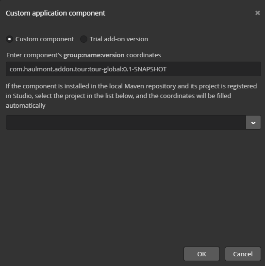
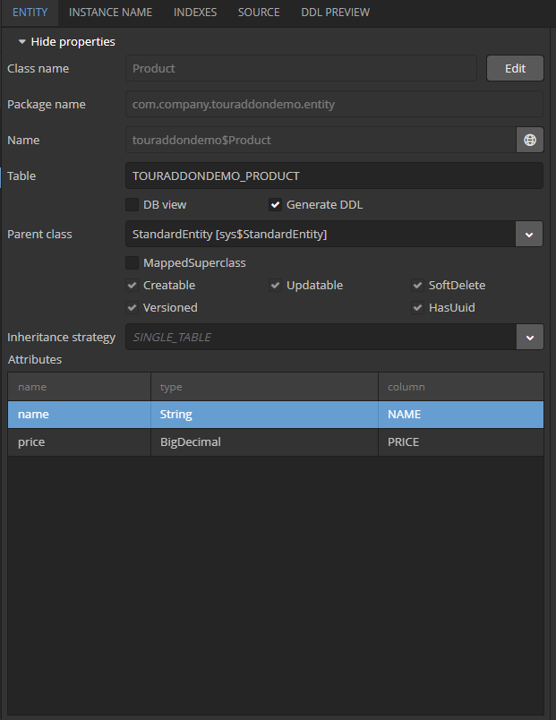
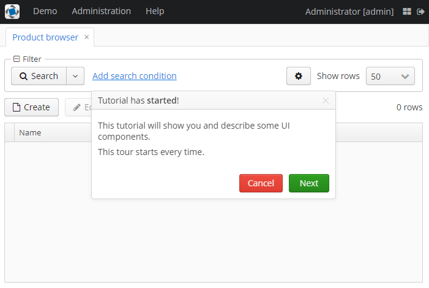
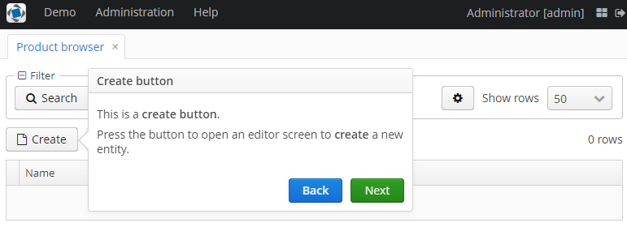
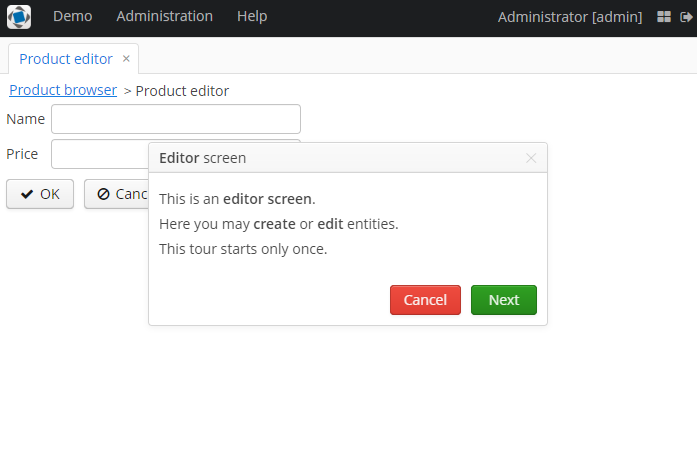
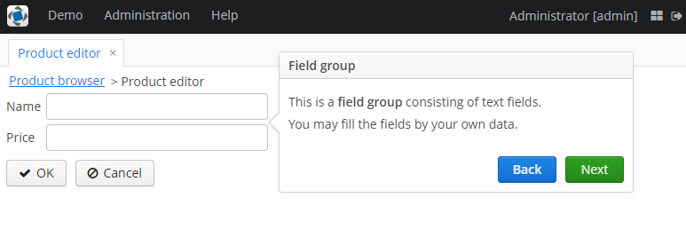

### Preface
This add-on is designed to create **product tour** for screens in the projects based on 
[CUBA platform](https://www.cuba-platform.com).

### Main features
The following components are used to create and run tours:
- **Tour** (A tour consisting of one or multiple steps)
- **Step** (A single step of a tour)
- **StepButton** (A button of a step that can be used to provide different actions if clicked)
- **TourStartAction** (Standard action to start a tour)
- **TourParser** (Parser of Tour objects)

### Usage
Select a version of the add-on which is compatible with the platform version used in your project:

| Platform Version| Add-on Version|
|:----------------|:--------------|
| 6.9.x           | 1.0.0         |


Add custom application component to your project (change the version part if needed):
```
com.haulmont.addon.tour:tour-global:1.0.0   
```

### Description
This add-on enables creating a product tour on your application's screens. Each step of the tour can be bound to any UI component, thus helping you to show and describe UI components.

The tour itself consists of steps, each having its own title, value (text), binding to a component, and some other configuration attributes. In order to interact between steps, the special `StepButton` buttons are used. These buttons may have either predefined actions from `TourActionType` and `StepActionType` or their own actions. The `Tour` interface is used for tours, while `Step` is used for steps. 


A tour can also be created with the help of the `parseTour()` method of `TourParser`, which receives a JSON, messagesPack, and window to extend.

To start a tour, call the `TourStartAction`. The `setSettingsEnabled()` method allows you to define whether the tour should start each time on the screen opening or only once at the first time.

### Quick start
To use this add-on in a CUBA Studio project, in the project properties add add-on like custom application component and
save settings.
```
com.haulmont.addon.tour:tour-global:1.0.0   
```

#### Sample task
As a hands-on example, let's create a small demo app containing two screens with tours.

In this app, we will:
- create tours on application screens,
- define different options for the tours steps,
- define the parameters of the tours start.

#### Step-by-step guide
Create a new CUBA project and add the given add-on to it.



In the DATA MODEL tab create a new entity "Product" with two attributes.



Create entity browser and entity editor screens via Generic UI screen.

Let's add a button which will start a tour in `ProductBrowse`, as well as implement the tours start on the screen opening.

To create the button, add the component below to the `buttonsPanel` component in `product-browse.xml`:

```xml
<button id="tourButton"
        caption="Tutorial" 
        invoke="startTour"/>
```

On the `ProductBrowse` screen initialization, we will parse the tour from the JSON file which is located in the same directory with screens.
This JSON file describes the list of steps for the tour. Each step is provided with several parameters and an array of buttons. 
For each button we describe its attributes and the action performed on the button's click.

`productBrowseTour.json`:
```JSON
[
  {
    "id": "step1",
    "text": "tour.tutorialStartedText",
    "title": "tour.tutorialStartedTitle",
    "width": "400",
    "textContentMode": "html",
    "titleContentMode": "html",
    "cancellable": "true",
    "buttons": [
      {
        "caption": "tour.cancel",
        "style": "danger",
        "action": "tour:cancel",
        "enabled": "true"
      },
      {
        "caption": "tour.next",
        "style": "friendly",
        "action": "tour:next",
        "enabled": "true"
      }
    ]
  },
  {
    "id": "step2",
    "text": "tour.createButtonText",
    "title": "tour.createButtonTitle",
    "width": "400",
    "textContentMode": "html",
    "titleContentMode": "html",
    "attachTo": "createBtn",
    "anchor": "right",
    "buttons": [
      {
        "caption": "tour.back",
        "style": "primary",
        "action": "tour:back",
        "enabled": "true"
      },
      {
        "caption": "tour.next",
        "style": "friendly",
        "action": "tour:next",
        "enabled": "true"
      }
    ]
  },
  {
    "id": "step3",
    "text": "tour.editButtonText",
    "title": "tour.editButtonTitle",
    "width": "400",
    "textContentMode": "html",
    "titleContentMode": "html",
    "attachTo": "editBtn",
    "anchor": "right",
    "buttons": [
      {
        "caption": "tour.back",
        "style": "primary",
        "action": "tour:back",
        "enabled": "true"
      },
      {
        "caption": "tour.next",
        "style": "friendly",
        "action": "tour:next",
        "enabled": "true"
      }
    ]
  },
  {
    "id": "step4",
    "text": "tour.removeButtonText",
    "title": "tour.removeButtonTitle",
    "width": "400",
    "textContentMode": "html",
    "titleContentMode": "html",
    "attachTo": "removeBtn",
    "anchor": "bottom",
    "buttons": [
      {
        "caption": "tour.back",
        "style": "primary",
        "action": "tour:back",
        "enabled": "true"
      },
      {
        "caption": "tour.next",
        "style": "friendly",
        "action": "tour:next",
        "enabled": "true"
      }
    ]
  },
  {
    "id": "step5",
    "text": "tour.filterPanelText",
    "title": "tour.filterPanelTitle",
    "width": "400",
    "textContentMode": "html",
    "titleContentMode": "html",
    "attachTo": "filter",
    "anchor": "bottom",
    "modal": "true",
    "buttons": [
      {
        "caption": "tour.back",
        "style": "primary",
        "action": "tour:back",
        "enabled": "true"
      },
      {
        "caption": "tour.finish",
        "style": "friendly",
        "action": "tour:next",
        "enabled": "true"
      }
    ]
  }
]
```

`ProductBrowse.java`:
```Java
@Inject
protected Resources resources;

@Inject
protected TourParser tourParser;

protected Tour tour;

@Override
public void init(Map<String, Object> params) {
    super.init(params);

    createTour();
}

protected void createTour() {
    String sourceFolder = "com/company/touraddondemo/web/product/";
    String file = resources.getResourceAsString(sourceFolder + "productBrowseTour.json");
    tour = tourParser.parseTour(file, getMessagesPack(), this);
}
```

Next, let's create a method to create an action which will start the tour. We'll disable the setting of starting a tour only one on the first screen opening.

```Java
public void startTour() {
    TourStartAction tourStartAction = TourStartAction.create(tour);
    tourStartAction.setSettingsEnabled(false);
    tourStartAction.actionPerform(this);
}
```

This method will be invoked on the `tourButton` click. Additionally, let's call this method at the screen initialization. 

At the `ProductEdit` initialization we will call the `createTour()` method where we create a tour instance, add the steps, their parameters, and buttons:

```Java
protected void createTour() {
    tour = new WebTour(this);

    Step step = new WebStep("step1");
    step.setText(getMessage("tour.editStartedText"));
    step.setTitle(getMessage("tour.editStartedTitle"));
    step.setWidth("400");
    step.setTextContentMode(Step.ContentMode.HTML);
    step.setTitleContentMode(Step.ContentMode.HTML);
    step.setCancellable(true);

    StepButton stepButton = new WebStepButton(getMessage("tour.cancel"));
    stepButton.setStyleName("danger");
    stepButton.setEnabled(true);
    stepButton.addStepButtonClickListener(TourActionType.CANCEL::execute);
    step.addButton(stepButton);

    stepButton = new WebStepButton(getMessage("tour.next"));
    stepButton.setStyleName("friendly");
    stepButton.setEnabled(true);
    stepButton.addStepButtonClickListener(TourActionType.NEXT::execute);
    step.addButton(stepButton);

    tour.addStep(step);

    step = new WebStep("step2");
    step.setText(getMessage("tour.fieldGroupText"));
    step.setTitle(getMessage("tour.fieldGroupTitle"));
    step.setWidth("400");
    step.setTextContentMode(Step.ContentMode.HTML);
    step.setTitleContentMode(Step.ContentMode.HTML);
    step.setAttachedTo(ComponentsHelper.findComponent(getFrame(), "fieldGroup"));
    step.setAnchor(Step.StepAnchor.RIGHT);

    stepButton = new WebStepButton(getMessage("tour.back"));
    stepButton.setStyleName("primary");
    stepButton.setEnabled(true);
    stepButton.addStepButtonClickListener(TourActionType.BACK::execute);
    step.addButton(stepButton);

    stepButton = new WebStepButton(getMessage("tour.next"));
    stepButton.setStyleName("friendly");
    stepButton.setEnabled(true);
    stepButton.addStepButtonClickListener(TourActionType.NEXT::execute);
    step.addButton(stepButton);

    tour.addStep(step);

    step = new WebStep("step3");
    step.setText(getMessage("tour.windowActionsText"));
    step.setTitle(getMessage("tour.windowActionsTitle"));
    step.setWidth("400");
    step.setTextContentMode(Step.ContentMode.HTML);
    step.setTitleContentMode(Step.ContentMode.HTML);
    step.setAttachedTo(ComponentsHelper.findComponent(getFrame(), "windowClose"));
    step.setAnchor(Step.StepAnchor.RIGHT);

    stepButton = new WebStepButton(getMessage("tour.back"));
    stepButton.setStyleName("primary");
    stepButton.setEnabled(true);
    stepButton.addStepButtonClickListener(TourActionType.BACK::execute);
    step.addButton(stepButton);

    stepButton = new WebStepButton(getMessage("tour.finish"));
    stepButton.setStyleName("friendly");
    stepButton.setEnabled(true);
    stepButton.addStepButtonClickListener(TourActionType.NEXT::execute);
    step.addButton(stepButton);

    tour.addStep(step);
}
```
Also, in the `init()` method we create an action that will start a tour without disabling additional settings.

In order to display localized messages, put them in `messages.properties`:

```properties
tour.createButtonText = <p>This is a <b>create button</b>.</p> \
  <p>Press the button to open an editor screen to <b>create</b> a new entity.</p>
tour.editButtonText = <p>This is an <b>edit button</b>.</p> \
  <p>Select an entity and press the button to open an editor screen to <b>edit</b> the entity.</p>
tour.removeButtonText = <p>This is a <b>remove button</b>.</p> \
  <p>Select an entity and press the button to remove the entity.</p>
tour.filterPanelText = <p>This is a <b>filter panel</b>.</p> \
  <p>You may choose conditions to filter entities.</p>
tour.fieldGroupText = <p>This is a <b>field group</b> consisting of text fields.</p> \
  <p>You may fill the fields by your own data.</p>
tour.windowActionsText = <p>These are window <b>actions</b>.</p> \
  <p>You are able to <b>confirm</b> or <b>decline</b> changes.</p>
tour.tutorialStartedText = <p>This tutorial will show you and describe some UI components.</p> \
  <p>This tour starts every time.</p>
tour.editStartedText = <p>This is an <b>editor screen</b>.</p> \
  <p>Here you may <b>create</b> or <b>edit</b> entities.</p> \
  <p>This tour starts only once.</p>
tour.editStartedTitle = <b>Editor</b> screen
tour.tutorialStartedTitle = Tutorial has <b>started</b>!
tour.createButtonTitle = <b>Create button</b>
tour.editButtonTitle = <b>Edit button</b>
tour.removeButtonTitle = <b>Remove button</b>
tour.filterPanelTitle = <b>Filter Panel</b>
tour.fieldGroupTitle = <b>Field group</b>
tour.windowActionsTitle = <b>Window actions</b>
tour.back = Back
tour.next = Next
tour.cancel = Cancel
tour.finish = Finish
```

For the correct display of the new components, we will need CSS classes that come with the add-on theme. To make them available for this project, we need to create a theme extension in Project Properties.

  

Now, when the user opens the `ProductBrowse` screen, each time they will see the tour. Moreover, they will be able to start the tour by clicking the "Tutorial" button. As for `ProductEdit` screen, the tour will start only at the first screen opening for each user.

This is how the `ProductBrowse` screen looks in the running app:



This is how the `ProductBrowse` screen looks with the step bound to the component:



This is how the `ProductEdit` screen looks in the running app:



This is how the `ProductEdit` screen looks with the step bound to the component:


